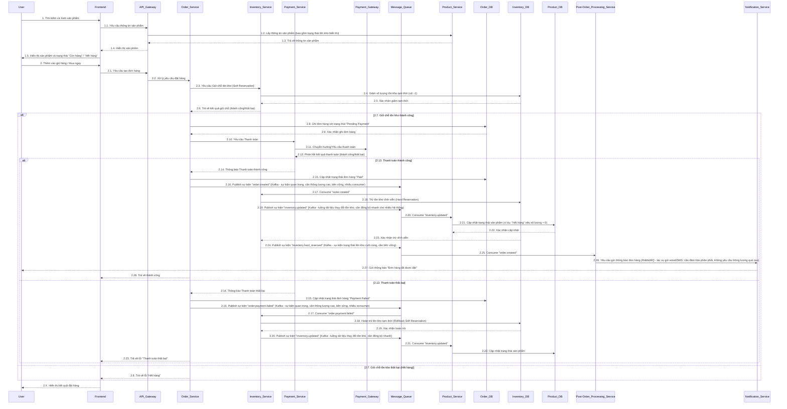
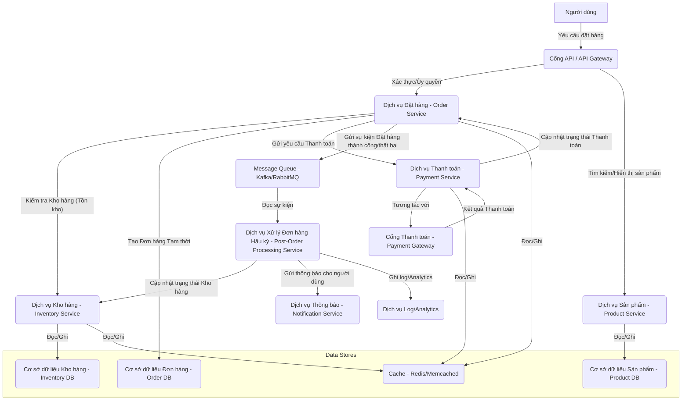
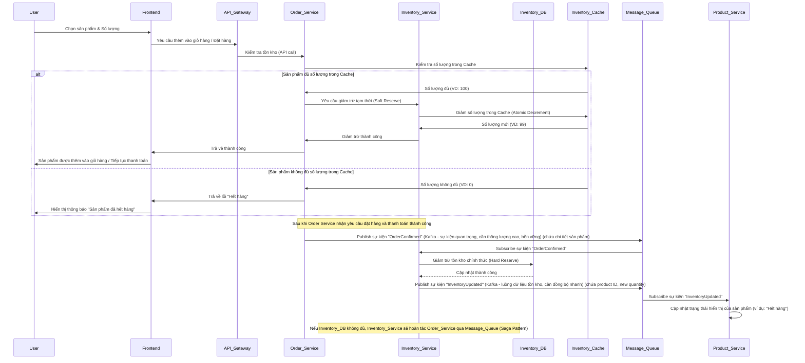
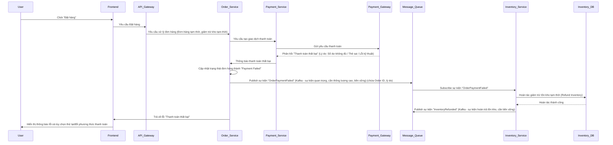
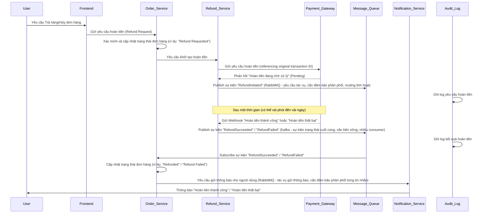

# Phân tích Luồng Xử lý Đặt hàng trong Thương mại điện tử (Ngày Sale)

## 1. Tổng quan Kiến trúc Hệ thống Xử lý Đơn hàng

Để có cái nhìn tổng quan về luồng xử lý đơn hàng, đặc biệt trong các tình huống phức tạp như ngày sale, chúng ta cần hình dung kiến trúc hệ thống cơ bản. Đây là một kiến trúc đơn giản hóa, tập trung vào các thành phần chính liên quan đến luồng đặt hàng.

### 1.1. Luồng Xử lý Đặt hàng Chi tiết và Đảm bảo Nhất quán Dữ liệu

Luồng đặt hàng trong một hệ thống thương mại điện tử lớn là một chuỗi các bước phức tạp, đòi hỏi sự phối hợp chặt chẽ giữa nhiều microservice để đảm bảo tính chính xác và nhất quán của dữ liệu.



**Mô tả chi tiết Luồng đặt hàng và Nhất quán dữ liệu:**

1.  **Tìm kiếm và Hiển thị Sản phẩm:**
    *   Người dùng tìm kiếm hoặc xem sản phẩm trên Frontend.
    *   Frontend gọi API Gateway, sau đó Product Service để lấy thông tin sản phẩm.
    *   **Product Service** chịu trách nhiệm cung cấp thông tin sản phẩm, bao gồm cả trạng thái tồn kho **hiển thị** (chứ không phải tồn kho thực tế để đặt hàng). Trạng thái này được đồng bộ từ Inventory Service.

2.  **Tạo Đơn hàng và Giữ chỗ Tồn kho (Soft Reservation):**
    *   Khi người dùng quyết định mua, Frontend gửi yêu cầu tạo đơn hàng đến API Gateway.
    *   **Order Service** nhận yêu cầu và gửi yêu cầu giữ chỗ tồn kho (Soft Reservation) đến **Inventory Service**.
    *   **Soft Reservation** là quá trình giảm số lượng tồn kho có sẵn một cách tạm thời, thường được thực hiện trong cơ sở dữ liệu của Inventory Service. Mục đích là để "khóa" số lượng sản phẩm cần thiết cho một giao dịch đang diễn ra, ngăn không cho người dùng khác mua phải sản phẩm đã gần hết hoặc đang trong quá trình thanh toán. Nó giống như việc bạn "đặt trước" một món hàng trong cửa hàng, nhưng chưa trả tiền. Nếu giao dịch không hoàn tất, số lượng này sẽ được hoàn trả lại. Cơ chế này giúp giảm thiểu tình trạng "hết hàng ảo" (false out-of-stock) khi nhiều người cùng lúc cố gắng mua một sản phẩm sắp hết.
    *   Nếu giữ chỗ thành công, Order Service tiếp tục luồng thanh toán. Nếu thất bại (do hết hàng), Order Service trả về lỗi cho Frontend.

3.  **Thanh toán:**
    *   **Order Service** yêu cầu **Payment Service** xử lý thanh toán. Payment Service tương tác với **Payment Gateway**.
    *   Kết quả thanh toán được trả về Payment Service, sau đó thông báo lại cho Order Service.

4.  **Xử lý sau Thanh toán và Trừ Tồn kho Vĩnh viễn (Hard Reservation):**
    *   **Nếu thanh toán thành công:**
        *   **Order Service** cập nhật trạng thái đơn hàng là "Paid" và **publish sự kiện `order.created`** lên Message Queue (Kafka/RabbitMQ).
        *   **Inventory Service** (consumer của `order.created` event) nhận sự kiện này và thực hiện **trừ tồn kho vĩnh viễn (Hard Reservation)** trong Inventory DB. **Hard Reservation** là quá trình giảm số lượng tồn kho một cách chính thức và không thể đảo ngược (trừ khi có yêu cầu hoàn hàng). Nó xảy ra sau khi giao dịch thanh toán đã được xác nhận thành công. Đây là lúc sản phẩm thực sự được gán cho đơn hàng và không còn khả dụng cho các đơn hàng khác.
        *   **Inventory Service** sau đó **publish sự kiện `inventory.updated`** lên Message Queue (Kafka - cần thông lượng cao, đồng bộ nhiều consumer, lưu giữ lịch sử thay đổi) để thông báo về sự thay đổi tồn kho.
        *   **Product Service** (consumer của `inventory.updated` event) nhận sự kiện này và **cập nhật trạng thái hiển thị của sản phẩm** trong Product DB (ví dụ: chuyển từ "Còn hàng" sang "Hết hàng" nếu số lượng về 0). Điều này đảm bảo thông tin sản phẩm trên website/ứng dụng luôn nhất quán với tồn kho thực tế.
        *   Các service khác (Post-Order Processing, Notification) cũng consume `order.created` (Kafka - sự kiện nền tảng cho nhiều luồng nghiệp vụ) để thực hiện các tác vụ hậu kỳ.
    *   **Nếu thanh toán thất bại:**
        *   **Order Service** cập nhật trạng thái đơn hàng là "Payment Failed" và **publish sự kiện `order.payment.failed`**.
        *   **Inventory Service** (consumer của `order.payment.failed` event) nhận sự kiện này và thực hiện **hoàn trả tồn kho tạm thời (rollback Soft Reservation)**, trả lại số lượng sản phẩm đã giữ chỗ.
        *   **Inventory Service** cũng **publish sự kiện `inventory.updated`** (Kafka - luồng dữ liệu thay đổi tồn kho, cần đồng bộ nhanh) (nếu có sự thay đổi tồn kho hiển thị do hoàn trả) để Product Service cập nhật lại.

**Đảm bảo Nhất quán giữa Product Service và Inventory Service:**
Tính nhất quán giữa thông tin sản phẩm (Product Service) và tồn kho (Inventory Service) được đảm bảo thông qua kiến trúc hướng sự kiện (event-driven architecture) sử dụng Message Queue:
*   **Inventory Service** là nguồn duy nhất của sự thật về tồn kho. Mọi thay đổi tồn kho (do đặt hàng, hủy, nhập hàng) đều được nó quản lý.
*   **Về việc sử dụng Redis cho CAS:**
    *   **Inventory Service** có thể sử dụng Redis làm lớp cache hoặc làm nơi lưu trữ tồn kho chính cho các sản phẩm "hot" (có tần suất truy cập cao) để đạt được thông lượng cao và độ trễ thấp. Trong trường hợp này, các thao tác CAS (ví dụ: `WATCH`/`MULTI`/`EXEC` của Redis hoặc các lệnh atomic `INCRBY`/`DECRBY` với điều kiện) sẽ được Inventory Service thực hiện trực tiếp trên Redis.
    *   Tuy nhiên, cần có cơ chế đồng bộ dữ liệu giữa Redis và Inventory DB (cơ sở dữ liệu bền vững), ví dụ: ghi vào DB bất đồng bộ hoặc định kỳ.
*   Khi tồn kho thay đổi, **Inventory Service** sẽ **publish sự kiện `inventory.updated`**.
*   **Product Service** sẽ **subscribe** sự kiện này. Khi nhận được `inventory.updated`, Product Service sẽ cập nhật trạng thái hiển thị của sản phẩm trong cơ sở dữ liệu của nó (`Product DB`). **Product Service không trực tiếp thực hiện CAS trên tồn kho.** Vai trò của nó là hiển thị thông tin sản phẩm, và nó nhận thông tin tồn kho đã được xử lý và xác nhận từ Inventory Service thông qua Message Queue. Nếu Product Service có cache riêng cho thông tin sản phẩm (ví dụ: Redis cache cho các trang sản phẩm), nó cũng sẽ cập nhật cache đó dựa trên sự kiện `inventory.updated`.
*   Cách tiếp cận này giúp giảm tải cho Inventory Service và đảm bảo tính nhất quán dữ liệu phân tán.



**Mô tả các thành phần chính:**

*   **Cổng API / API Gateway:** Điểm vào duy nhất cho tất cả các yêu cầu từ người dùng. Thực hiện xác thực, ủy quyền cơ bản.
*   **Dịch vụ Đặt hàng (Order Service):** Core của luồng đặt hàng. Xử lý logic tạo, cập nhật, hủy đơn hàng. Tương tác với các dịch vụ khác.
*   **Dịch vụ Kho hàng (Inventory Service):** Quản lý trạng thái tồn kho của sản phẩm. Rất quan trọng trong ngày sale.
*   **Dịch vụ Thanh toán (Payment Service):** Xử lý logic liên quan đến thanh toán, tương tác với các cổng thanh toán bên ngoài.
*   **Cổng Thanh toán (Payment Gateway):** Hệ thống bên thứ ba để xử lý giao dịch tài chính (ví dụ: Momo, VNPay, Visa).
*   **Message Queue (Kafka/RabbitMQ):** Đảm bảo tính nhất quán dữ liệu và xử lý bất đồng bộ. Các sự kiện quan trọng (đặt hàng, thanh toán) được publish lên đây.
*   **Dịch vụ Xử lý Đơn hàng Hậu kỳ (Post-Order Processing Service):** Subscribe các sự kiện từ Message Queue để thực hiện các tác vụ sau đặt hàng như trừ kho, gửi thông báo, cập nhật trạng thái.
*   **Dịch vụ Thông báo (Notification Service):** Gửi email, SMS, push notification cho người dùng.
*   **Cơ sở dữ liệu Đơn hàng (Order DB), Kho hàng (Inventory DB):** Lưu trữ dữ liệu về đơn hàng và tồn kho.
*   **Cache (Redis/Memcached):** Lưu trữ dữ liệu tạm thời để tăng tốc độ truy xuất, giảm tải cho database (ví dụ: tồn kho sản phẩm hot, thông tin sản phẩm).
*   **Dịch vụ Sản phẩm (Product Service):** Quản lý thông tin chi tiết về sản phẩm (tên, mô tả, giá, hình ảnh, trạng thái). Đồng bộ thông tin sản phẩm với tồn kho để đảm bảo hiển thị chính xác trạng thái sản phẩm cho người dùng.

---

## 2. Xử lý Hết hàng (Out of Stock)

Trong ngày sale, vấn đề hết hàng trở nên cực kỳ nhạy cảm do lượng truy cập và đặt hàng tăng đột biến.

### Luồng xử lý và các thách thức:

1.  **Kiểm tra tồn kho ban đầu (Pre-order Inventory Check):** Khi người dùng thêm sản phẩm vào giỏ hàng hoặc tiến hành thanh toán.
2.  **Giảm trừ tồn kho tạm thời (Soft Reservation / Optimistic Locking):**
    *   Khi người dùng bắt đầu quá trình đặt hàng (ví dụ: thêm vào giỏ hàng, tiến hành thanh toán), hệ thống sẽ thực hiện giảm trừ tồn kho tạm thời. Đây là việc "giữ chỗ" số lượng sản phẩm cần thiết cho đơn hàng đó trong một khoảng thời gian nhất định.
    *   **Cơ chế:** Thường được thực hiện bằng cách cập nhật một trường `reserved_quantity` hoặc giảm trực tiếp `available_quantity` trong cơ sở dữ liệu hoặc cache, nhưng với khả năng hoàn tác dễ dàng. Các kỹ thuật như Optimistic Locking (sử dụng version number) hoặc các transaction ngắn gọn có thể được áp dụng để đảm bảo an toàn dữ liệu.
    *   **Mục đích:** Ngăn chặn tình trạng bán quá số lượng (overselling) và đảm bảo rằng sản phẩm có sẵn cho người dùng đang thực hiện giao dịch. Nếu người dùng không hoàn tất giao dịch trong một khoảng thời gian (timeout), số lượng này sẽ được hoàn trả lại kho.

3.  **Xác nhận tồn kho cuối cùng (Hard Reservation / Pessimistic Locking):**
    *   Xảy ra sau khi thanh toán đã được xác nhận thành công. Đây là lúc tồn kho được trừ đi một cách vĩnh viễn khỏi hệ thống.
    *   **Cơ chế:** Thường là một thao tác cập nhật cơ sở dữ liệu không thể đảo ngược (trừ khi có quy trình hoàn hàng). Để đảm bảo tính nguyên tử và idempotency trong môi trường tải cao, có thể sử dụng Pessimistic Locking (khóa bản ghi tồn kho trong suốt quá trình giao dịch) hoặc các thao tác Compare-and-Swap (CAS) thông qua Optimistic Locking (sử dụng một trường `version` trong bản ghi tồn kho).
        *   **Ví dụ (Optimistic Locking với `version` field):**
            ```sql
            UPDATE inventory
            SET quantity = quantity - X, version = version + 1
            WHERE product_id = Y AND quantity >= X AND version = [old_version];
            ```
            Nếu `old_version` không khớp, giao dịch sẽ thất bại và cần được retry với `old_version` mới nhất.
        *   **Ví dụ (CAS trên Redis):** Sử dụng các lệnh `WATCH`, `MULTI`, `EXEC` để đảm bảo tính nguyên tử khi cập nhật tồn kho trong Redis cache.
    *   **Mục đích:** Đảm bảo rằng sản phẩm đã được bán và không còn khả dụng cho bất kỳ đơn hàng mới nào.
4.  **Xử lý khi hết hàng:** Thông báo cho người dùng, xóa khỏi giỏ hàng/đơn hàng, đề xuất sản phẩm tương tự.

### Giải pháp kỹ thuật và Design Patterns:

*   **Cache (Redis/Memcached):** Lưu trữ tồn kho của các sản phẩm hot, sử dụng `decrement` atomic.
*   **Message Queue (Kafka/RabbitMQ):** Publish sự kiện `OrderPlaced` hoặc `InventoryReservationRequested` để xử lý bất đồng bộ.
*   **Distributed Locking (Redisson/Zookeeper):** Sử dụng cho các thao tác ghi quan trọng để đảm bảo tính nguyên tử.
*   **Circuit Breaker Pattern:** "Ngắt mạch" yêu cầu đến Inventory Service nếu quá tải.
*   **Saga Pattern:** Quản lý tính nhất quán dữ liệu trong các giao dịch phân tán.

### Mermaid Diagram cho luồng xử lý "Hết hàng":



---

## 3. Xử lý Thanh toán thất bại (Payment Failure)

Thanh toán thất bại là một trong những vấn đề phổ biến nhất trong giao dịch thương mại điện tử.

### Luồng xử lý và các nguyên nhân thất bại:

1.  **Khởi tạo giao dịch thanh toán:** Order Service gửi yêu cầu đến Payment Service, sau đó tương tác với Payment Gateway.
2.  **Chờ phản hồi từ Payment Gateway:** Hệ thống chờ kết quả giao dịch.
    *   **Nguyên nhân phổ biến:** Sai thông tin thẻ, không đủ số dư, ngân hàng từ chối, lỗi kỹ thuật của Payment Gateway, timeout, mạng lưới không ổn định, giao dịch trùng lặp.
3.  **Xử lý kết quả thất bại:** Cập nhật trạng thái đơn hàng, thông báo cho người dùng, hoàn tác các tác vụ trước đó (nếu có), ghi log chi tiết.

### Giải pháp kỹ thuật và Design Patterns:

*   **Idempotency (Tính bất biến):** Ngăn chặn tình trạng trùng lặp giao dịch.
*   **Retry Mechanism (Cơ chế thử lại):** Xử lý lỗi tạm thời.
*   **Webhooks và Callback URLs:** Nhận kết quả giao dịch đáng tin cậy từ Payment Gateway.
*   **Saga Pattern:** Đảm bảo tính nhất quán dữ liệu giữa các microservice khi thanh toán thất bại.
*   **Dead Letter Queue (DLQ):** Xử lý các thông báo từ Message Queue không thể xử lý được.
*   **Graceful Degradation (Giảm cấp linh hoạt):** Duy trì chức năng cốt lõi khi Payment Gateway bị quá tải.
*   **Observability (Khả năng quan sát):** Logging, monitoring, và alerting.

### Mermaid Diagram cho luồng xử lý "Thanh toán thất bại":



---

## 4. Xử lý Hoàn tiền (Refund)

Hoàn tiền là một quy trình quan trọng, đòi hỏi sự chính xác cao về mặt tài chính và sự phối hợp giữa nhiều hệ thống.

### Luồng xử lý và các nguyên nhân yêu cầu hoàn tiền:

1.  **Yêu cầu hoàn tiền:** Từ người dùng, hệ thống tự động, hoặc bộ phận chăm sóc khách hàng.
2.  **Xác minh và phê duyệt:** Xác minh tính hợp lệ của yêu cầu.
3.  **Khởi tạo giao dịch hoàn tiền:** Refund Service tương tác với Payment Gateway để khởi tạo giao dịch.
4.  **Chờ phản hồi từ Payment Gateway:** Hệ thống chờ kết quả hoàn tiền.
    *   **Nguyên nhân thất bại:** Lỗi kỹ thuật của Payment Gateway, sai thông tin giao dịch gốc, vượt quá thời gian cho phép, số dư không đủ (của người bán).
5.  **Cập nhật trạng thái và thông báo:** Cập nhật trạng thái và thông báo cho người dùng.

### Giải pháp kỹ thuật và Design Patterns:

*   **Dedicated Refund Service:** Tách biệt logic hoàn tiền vào một microservice riêng biệt.
*   **State Machine (Máy trạng thái):** Mô hình hóa quy trình hoàn tiền phức tạp.
*   **Idempotency:** Tránh việc hoàn tiền nhiều lần.
*   **Asynchronous Processing (Xử lý bất đồng bộ):** Sử dụng Message Queue.
*   **Webhooks/Callback:** Nhận thông báo kết quả hoàn tiền.
*   **Audit Logging (Ghi log kiểm toán) và Reconciliation (Đối soát):** Đảm bảo tính chính xác tài chính.
*   **Security Considerations (Cân nhắc bảo mật):** Chỉ người được ủy quyền mới có thể yêu cầu/phê duyệt.

### Mermaid Diagram cho luồng xử lý "Hoàn tiền":



---

## 5. Tổng hợp các Giải pháp Kỹ thuật và Mẫu thiết kế Chung

Đây là danh sách tổng hợp các giải pháp và mẫu thiết kế đã được đề cập xuyên suốt ba tình huống trên, đóng vai trò quan trọng trong việc xây dựng một hệ thống xử lý đơn hàng mạnh mẽ và đáng tin cậy:

*   **Cache (Redis/Memcached):** Tăng tốc độ, giảm tải.
*   **Message Queue (Kafka/RabbitMQ):** Xử lý bất đồng bộ, giảm coupling.
*   **Distributed Locking:** Đảm bảo tính nguyên tử cho các thao tác quan trọng.
*   **Idempotency:** Ngăn chặn xử lý trùng lặp.
*   **Retry Mechanism:** Xử lý lỗi tạm thời.
*   **Webhooks và Callback URLs:** Nhận thông báo đáng tin cậy từ hệ thống bên ngoài.
*   **Saga Pattern:** Đảm bảo tính nhất quán dữ liệu trong giao dịch phân tán.
*   **Circuit Breaker Pattern:** Bảo vệ hệ thống khỏi các dịch vụ phụ thuộc lỗi.
*   **State Machine:** Quản lý quy trình phức tạp.
*   **Audit Logging và Reconciliation:** Đảm bảo tính chính xác tài chính.
*   **Graceful Degradation:** Duy trì chức năng cốt lõi.

---

## 6. Lựa chọn và Thiết kế Message Queue

Message Queue (MQ) đóng vai trò trung tâm trong kiến trúc microservices hiện đại, đặc biệt quan trọng trong các hệ thống thương mại điện tử có lưu lượng truy cập cao như Shopee vào ngày sale.

### 6.1. Tại sao cần sử dụng Message Queue?

Việc áp dụng Message Queue mang lại nhiều lợi ích then chốt:

*   **Xử lý Bất đồng bộ (Asynchronous Processing):** Cho phép các tác vụ tốn thời gian hoặc không yêu cầu phản hồi ngay lập tức được xử lý ở chế độ nền, giải phóng tài nguyên cho các yêu cầu đồng bộ. Ví dụ: cập nhật tồn kho, gửi email thông báo, ghi log.
*   **Giảm sự Phụ thuộc (Decoupling):** Các microservice không cần giao tiếp trực tiếp với nhau, mà thông qua MQ. Điều này giúp các dịch vụ độc lập hơn, dễ dàng phát triển, triển khai và mở rộng mà không ảnh hưởng đến nhau.
*   **Khả năng Mở rộng (Scalability):** Dễ dàng thêm các instance của consumer để xử lý lượng tin nhắn tăng lên, hoặc thêm producer khi có nhiều dữ liệu cần gửi đi.
*   **Độ bền và Khả năng phục hồi (Durability & Resilience):** Tin nhắn được lưu trữ trong queue cho đến khi được consumer xử lý thành công, đảm bảo không mất dữ liệu ngay cả khi consumer gặp sự cố.
*   **Đệm Tải (Load Leveling/Buffering):** MQ giúp làm mềm các đỉnh tải đột biến, bảo vệ các dịch vụ downstream khỏi bị quá tải bằng cách phân phối tin nhắn một cách đều đặn.

### 6.2. Kafka vs. RabbitMQ: Khi nào sử dụng loại nào?

Cả Kafka và RabbitMQ đều là các hệ thống Message Queue phổ biến, nhưng chúng được thiết kế cho các trường hợp sử dụng khác nhau.

#### RabbitMQ

*   **Mô hình:** Message Broker truyền thống, tập trung vào việc đảm bảo tin nhắn được gửi đến consumer một cách an toàn và nhanh chóng.
*   **Đặc điểm nổi bật:**
    *   Hỗ trợ nhiều giao thức messaging (AMQP, MQTT, STOMP).
    *   Cung cấp các tính năng routing phức tạp (exchanges, queues, bindings).
    *   Hỗ trợ xác nhận tin nhắn (acknowledgments) và cơ chế thử lại (retries) mạnh mẽ.
    *   Dễ dàng thiết lập và quản lý cho các trường hợp sử dụng cơ bản.
*   **Trường hợp sử dụng phù hợp:**
    *   **Xử lý tác vụ ngắn, độc lập (Task Queues):** Ví dụ: gửi email, xử lý hình ảnh, thông báo.
    *   **Giao tiếp giữa các dịch vụ cần độ tin cậy cao của từng tin nhắn:** Đảm bảo mỗi tin nhắn được xử lý ít nhất một lần.
    *   **Routing phức tạp dựa trên nội dung tin nhắn.**
    *   **Khi yêu cầu "at-most-once" hoặc "at-least-once" delivery cho các tác vụ.**
*   **Ví dụ trong luồng đặt hàng:**
    *   Gửi thông báo email/SMS cho người dùng sau khi đặt hàng.
    *   Kích hoạt các tác vụ hậu kỳ đơn hàng (cập nhật trạng thái vận chuyển, ghi log).
    *   Xử lý các yêu cầu hoàn tiền độc lập.

#### Kafka

*   **Mô hình:** Distributed Streaming Platform, tập trung vào việc xử lý luồng dữ liệu lớn theo thời gian thực và lưu trữ dữ liệu bền vững.
*   **Đặc điểm nổi bật:**
    *   Thông lượng cao (high-throughput), độ trễ thấp (low-latency).
    *   Khả năng mở rộng ngang (horizontal scalability) vượt trội.
    *   Lưu trữ tin nhắn bền vững (dạng log), cho phép nhiều consumer đọc cùng một tin nhắn nhiều lần.
    *   Hỗ trợ xử lý luồng (stream processing) mạnh mẽ với Kafka Streams hoặc KSQL.
    *   Đảm bảo thứ tự tin nhắn trong một partition.
*   **Trường hợp sử dụng phù hợp:**
    *   **Thu thập và xử lý log sự kiện:** Log hệ thống, log giao dịch.
    *   **Xử lý luồng dữ liệu lớn theo thời gian thực:** Ví dụ: theo dõi hành vi người dùng, phân tích dữ liệu bán hàng.
    *   **Đồng bộ dữ liệu giữa các hệ thống:** Đảm bảo tính nhất quán dữ liệu phân tán.
    *   **Event Sourcing và CQRS.**
    *   **Khi yêu cầu "at-least-once" hoặc "exactly-once" delivery với khả năng phục hồi.**
*   **Ví dụ trong luồng đặt hàng:**
    *   Ghi nhận tất cả các sự kiện liên quan đến đơn hàng (OrderCreated, PaymentFailed, InventoryUpdated) để phân tích, audit, hoặc xây dựng các hệ thống báo cáo.
    *   Đồng bộ trạng thái tồn kho từ Inventory Service sang Product Service.
    *   Xây dựng luồng dữ liệu cho các hệ thống analytics hoặc machine learning.

#### Lựa chọn thực tế:

Trong một hệ thống thương mại điện tử lớn như Shopee, việc kết hợp cả hai thường là lựa chọn tối ưu (Polyglot Messaging):
*   **Kafka:** Dùng cho các luồng dữ liệu sự kiện lớn, cần thông lượng cao, khả năng mở rộng tốt và lưu trữ bền vững (ví dụ: OrderConfirmed, InventoryUpdated, PaymentProcessed events).
*   **RabbitMQ:** Dùng cho các tác vụ yêu cầu routing phức tạp, cần đảm bảo từng tin nhắn được xử lý (ví dụ: gửi email, SMS, push notification, các tác vụ nghiệp vụ có độ trễ chấp nhận được).

### 6.3. Thiết kế thực tế để đảm bảo độ tin cậy và hiệu suất

Để đảm bảo Message Queue hoạt động hiệu quả và tin cậy trong môi trường tải cao:

#### 6.3.1. Thiết kế Producer (Người gửi tin nhắn)

*   **Đảm bảo gửi tin nhắn (Guaranteed Delivery):**
    *   **Retry Mechanism:** Producer nên có cơ chế thử lại (retry) khi gửi tin nhắn thất bại (ví dụ: do lỗi mạng tạm thời).
    *   **Persistent Messages:** Cấu hình tin nhắn là persistent để đảm bảo chúng không bị mất khi broker bị crash (đối với RabbitMQ).
    *   **Acknowledgments (acks):** Producer nên chờ xác nhận từ broker rằng tin nhắn đã được nhận thành công (đối với Kafka, `acks=all` hoặc `acks=1`).
    *   **Idempotent Producers:** Đối với Kafka, sử dụng idempotent producers để tránh tin nhắn trùng lặp trong trường hợp thử lại.

*   **Xử lý lỗi:**
    *   **Log errors:** Ghi log chi tiết khi gửi tin nhắn thất bại.
    *   **Fallback mechanism:** Có cơ chế dự phòng nếu MQ không khả dụng (ví dụ: lưu vào database và thử lại sau).

#### 6.3.2. Thiết kế Consumer (Người nhận tin nhắn)

*   **Đảm bảo xử lý tin nhắn (Guaranteed Processing):**
    *   **Acknowledgments:** Consumer phải xác nhận (ack) tin nhắn chỉ sau khi đã xử lý thành công. Nếu không ack, tin nhắn sẽ được trả lại queue để xử lý lại (đối với RabbitMQ) hoặc consumer offset không được commit (đối với Kafka).
    *   **At-least-once Delivery:** Đảm bảo tin nhắn được xử lý ít nhất một lần. Điều này có nghĩa là consumer phải là idempotent để xử lý tin nhắn trùng lặp mà không gây ra tác dụng phụ.
    *   **Exactly-once Delivery (Kafka):** Khó đạt được hoàn toàn, thường yêu cầu sự kết hợp của idempotent producers, atomic commits của offset và kết quả xử lý.

*   **Xử lý lỗi và Độ bền:**
    *   **Dead Letter Queue (DLQ):** Tin nhắn không thể xử lý sau nhiều lần thử lại sẽ được chuyển vào DLQ để phân tích và xử lý thủ công.
    *   **Error Handling:** Consumer cần có logic xử lý ngoại lệ mạnh mẽ để không bị crash khi gặp tin nhắn lỗi.
    *   **Concurrency:** Chạy nhiều consumer instance hoặc sử dụng multi-threading trong consumer để tăng thông lượng.

*   **Monitoring:**
    *   Theo dõi các chỉ số quan trọng: số lượng tin nhắn trong queue, độ trễ xử lý, số lượng consumer, lỗi producer/consumer.
    *   Thiết lập cảnh báo khi có vấn đề.

#### 6.3.3. Thiết kế Topic/Queue và Schema

*   **Đặt tên rõ ràng:** Topic/Queue nên có tên mô tả rõ ràng mục đích của chúng (ví dụ: `order.created`, `inventory.updated`, `user.notifications`).
*   **Phân vùng (Partitioning) (Kafka):** Phân vùng dữ liệu dựa trên một key (ví dụ: `order_id`, `product_id`) để đảm bảo thứ tự tin nhắn và phân phối tải đều.
*   **Schema Evolution:** Sử dụng schema registry (ví dụ: Avro, Protobuf) để quản lý schema của tin nhắn, đảm bảo khả năng tương thích ngược khi schema thay đổi.
```

Tham khảo chi tiết về thiết kế Message Queue trong file riêng: [`ecommerce/message_queue_design.md`](ecommerce/message_queue_design.md)