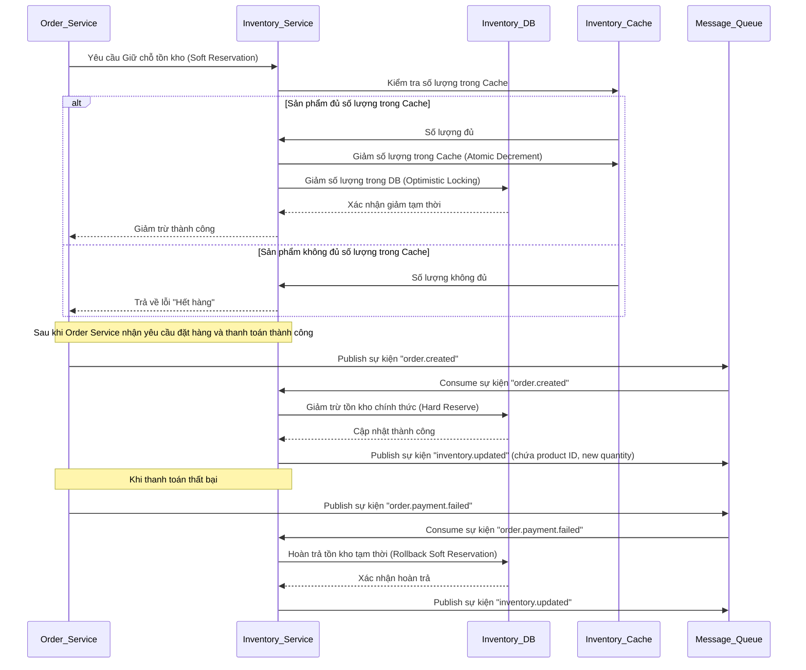

# Tài liệu Thiết kế Kỹ thuật: Dịch vụ Kho hàng (Inventory Service)

## 1. Tổng quan

Dịch vụ Kho hàng (Inventory Service) là nguồn duy nhất của sự thật về trạng thái tồn kho của sản phẩm. Nó quản lý số lượng sản phẩm có sẵn, xử lý các yêu cầu giữ chỗ tồn kho (soft reservation), trừ tồn kho vĩnh viễn (hard reservation), và hoàn trả tồn kho. Inventory Service đóng vai trò cực kỳ quan trọng trong việc ngăn chặn tình trạng bán quá số lượng (overselling) và đảm bảo tính nhất quán tồn kho trên toàn hệ thống, đặc biệt trong các sự kiện sale với lượng truy cập cao.

## 2. Yêu cầu

### 2.1 Yêu cầu Chức năng

*   Là hệ thống, cần có khả năng giữ chỗ tồn kho tạm thời (Soft Reservation) cho các đơn hàng đang chờ xử lý.
*   Là hệ thống, cần có khả năng trừ tồn kho vĩnh viễn (Hard Reservation) sau khi thanh toán thành công.
*   Là hệ thống, cần có khả năng hoàn trả tồn kho tạm thời khi đơn hàng bị hủy hoặc thanh toán thất bại.
*   Là hệ thống, cần publish các sự kiện thay đổi tồn kho để đồng bộ với các dịch vụ khác.
*   Là hệ thống, cần cung cấp thông tin tồn kho cho các dịch vụ khác (ví dụ: Product Service để hiển thị).

### 2.2 Yêu cầu Phi chức năng

*   **Hiệu suất:** Khả năng xử lý thông lượng rất cao các yêu cầu giảm trừ/tăng tồn kho, độ trễ thấp.
*   **Độ tin cậy:** Đảm bảo tính chính xác và nhất quán tuyệt đối của số lượng tồn kho.
*   **Khả năng mở rộng:** Có thể mở rộng ngang để đáp ứng tải đột biến.
*   **Bảo mật:** Bảo vệ dữ liệu tồn kho khỏi thao tác trái phép.
*   **Khả năng phục hồi:** Có thể phục hồi nhanh chóng sau sự cố mà không làm mất dữ liệu tồn kho.

## 3. Thiết kế Kỹ thuật

### 3.1. Thay đổi Mô hình Dữ liệu

*   **Inventory DB:**
    *   `Inventory` (ProductID, AvailableQuantity, ReservedQuantity, Version, LastUpdatedAt, ...).
    *   `InventoryLog` (LogID, ProductID, ChangeType (e.g., SOFT_RESERVE, HARD_RESERVE, REFUND), QuantityChange, NewQuantity, Timestamp, OrderID, ...).

### 3.2. Thay đổi API

*   `POST /api/inventory/soft-reserve`: Yêu cầu giữ chỗ tồn kho tạm thời.
    *   Request: `{ productId, quantity, orderId }`
    *   Response: `{ success: true/false, currentAvailableQuantity }`
*   `POST /api/inventory/hard-reserve`: Yêu cầu trừ tồn kho vĩnh viễn.
    *   Request: `{ productId, quantity, orderId }`
    *   Response: `{ success: true/false }`
*   `POST /api/inventory/rollback-soft-reserve`: Hoàn trả tồn kho tạm thời.
    *   Request: `{ productId, quantity, orderId }`
    *   Response: `{ success: true/false }`
*   `GET /api/inventory/{productId}`: Lấy thông tin tồn kho (nội bộ, cho Product Service).

### 3.3. Thay đổi UI
*   Không có UI trực tiếp cho Inventory Service. Nó tương tác với các UI khác thông qua Product Service (hiển thị trạng thái sản phẩm) và Order Service (thông báo hết hàng khi đặt hàng).

### 3.4. Luồng Logic



### 3.5. Caching Strategy

*   **Redis/Memcached:** Sử dụng Redis làm lớp cache hoặc thậm chí là nguồn tồn kho chính cho các sản phẩm "hot" (có tần suất truy cập cao) để đạt thông lượng cao và độ trễ thấp.
    *   Thao tác atomic decrement/increment trên Redis.
    *   Cần cơ chế đồng bộ dữ liệu giữa Redis và Inventory DB (bền vững), ví dụ: ghi vào DB bất đồng bộ hoặc định kỳ.

### 3.6. Concurrency Handling

*   **Optimistic Locking:** Sử dụng trường `version` trong Inventory DB để đảm bảo chỉ có một giao dịch có thể cập nhật cùng một bản ghi tồn kho tại một thời điểm.
    ```sql
    UPDATE inventory
    SET quantity = quantity - X, version = version + 1
    WHERE product_id = Y AND quantity >= X AND version = [old_version];
    ```
*   **Compare-and-Swap (CAS) trên Redis:** Đối với các thao tác trên Redis, sử dụng `WATCH`/`MULTI`/`EXEC` hoặc các lệnh atomic (ví dụ: `DECRBY`).
*   **Distributed Locking (Redisson/Zookeeper):** Có thể được sử dụng trong các trường hợp phức tạp hơn để đảm bảo tính nguyên tử cho một khối logic lớn hơn, nhưng nên hạn chế để không ảnh hưởng đến hiệu suất.

### 3.7. Phụ thuộc

*   **Microservices:**
    *   `Order Service`: Là producer của các yêu cầu soft-reserve, consumer của các sự kiện order.created/order.payment.failed.
    *   `Product Service`: Là consumer của các sự kiện inventory.updated.
*   **Message Queue:** Kafka (cho các sự kiện quan trọng như `order.created`, `order.payment.failed`, `inventory.updated`) và RabbitMQ (nếu có các tác vụ routing phức tạp hơn).
*   **Database:** Inventory DB (ví dụ: PostgreSQL, MySQL).
*   **Cache:** Redis (hoặc Memcached) cho tồn kho hot.

### 3.8. Cân nhắc Bảo mật

*   Chỉ các dịch vụ nội bộ được ủy quyền (Order Service) mới có thể gọi các API của Inventory Service. Không để lộ các API này ra bên ngoài.
*   Đảm bảo dữ liệu tồn kho được bảo vệ khỏi thao tác trái phép.

### 3.9. Cân nhắc Hiệu suất

*   **Sử dụng Cache (Redis):** Giảm đáng kể số lượng truy vấn đến Inventory DB cho các sản phẩm hot.
*   **Atomic Operations:** Sử dụng các thao tác atomic trên Redis hoặc DB để giảm thiểu contention.
*   **Event-driven Architecture:** Xử lý các cập nhật tồn kho bất đồng bộ thông qua Message Queue giúp giảm tải cho Order Service và tăng thông lượng chung.
*   **Phân vùng (Partitioning) DB/Cache:** Phân vùng dữ liệu tồn kho để phân phối tải đều và tăng khả năng mở rộng.

## 4. Kế hoạch Kiểm tra

*   **Unit Tests:** Viết unit tests cho các lớp nghiệp vụ và repository của Inventory Service, đặc biệt tập trung vào logic giữ chỗ, trừ và hoàn trả tồn kho.
*   **Integration Tests:**
    *   Kiểm tra luồng Soft Reservation và Hard Reservation tích hợp với Order Service.
    *   Kiểm tra việc publish sự kiện `inventory.updated` và consume các sự kiện `order.created`/`order.payment.failed` từ Message Queue.
    *   Kiểm tra tính đúng đắn của Optimistic Locking và CAS trên Redis.
*   **Performance Tests:** Kiểm tra khả năng chịu tải của Inventory Service dưới tải rất cao, đặc biệt trong các tình huống cạnh tranh tài nguyên (contention).

## 5. Câu hỏi Mở

*   Chiến lược đồng bộ dữ liệu giữa Redis cache và Inventory DB bền vững sẽ được triển khai chi tiết như thế nào (ví dụ: write-through, write-back, write-around)?
*   Cơ chế Dead Letter Queue và Retry cho các sự kiện liên quan đến tồn kho sẽ được cấu hình như thế nào trong Message Queue?
*   Có cần các cơ chế cảnh báo sớm (alerting) khi tồn kho một sản phẩm nào đó xuống dưới ngưỡng an toàn không?

## 6. Các Phương án Đã Xem xét

*   **Inventory Service trực tiếp gọi Product Service:** Loại bỏ vì sẽ tạo coupling chặt chẽ. Tiếp cận event-driven thông qua Message Queue tốt hơn.
*   **Chỉ sử dụng DB cho tồn kho:** Loại bỏ vì không thể đáp ứng yêu cầu hiệu suất và thông lượng cao trong các sự kiện sale. Cần một lớp cache hiệu năng cao như Redis.
*   **Pessimistic Locking trên DB:** Loại bỏ vì sẽ gây ra contention và giảm thông lượng đáng kể trong môi trường tải cao, đặc biệt cho các sản phẩm hot. Optimistic Locking hoặc CAS trên Redis là lựa chọn tốt hơn.