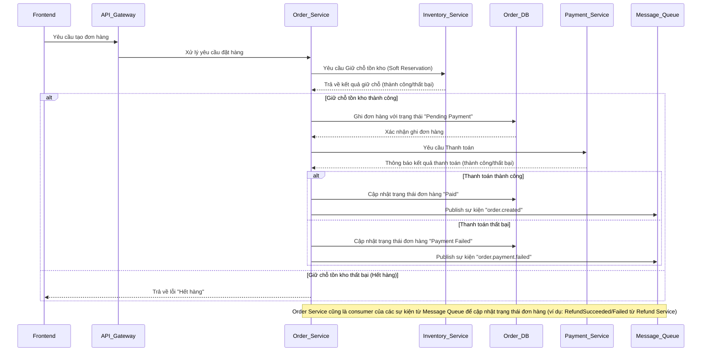

# Tài liệu Thiết kế Kỹ thuật: Dịch vụ Đặt hàng (Order Service)

## 1. Tổng quan

Dịch vụ Đặt hàng (Order Service) là thành phần cốt lõi trong luồng xử lý đơn hàng của hệ thống thương mại điện tử. Nó chịu trách nhiệm quản lý toàn bộ vòng đời của một đơn hàng, từ khi khởi tạo đến khi hoàn tất hoặc hủy bỏ, bao gồm các logic nghiệp vụ quan trọng liên quan đến trạng thái đơn hàng và tương tác với các dịch vụ khác như Kho hàng, Thanh toán và Thông báo.

## 2. Yêu cầu

### 2.1 Yêu cầu Chức năng

*   Là người dùng, tôi muốn có thể tạo một đơn hàng mới.
*   Là người dùng, tôi muốn có thể xem chi tiết các đơn hàng của mình.
*   Là người dùng, tôi muốn có thể hủy một đơn hàng nếu đơn hàng chưa được xử lý hoặc thanh toán.
*   Là hệ thống, cần cập nhật trạng thái đơn hàng dựa trên kết quả thanh toán.
*   Là hệ thống, cần cập nhật trạng thái đơn hàng dựa trên kết quả xử lý tồn kho.
*   Là hệ thống, cần cập nhật trạng thái đơn hàng khi có yêu cầu hoàn tiền và kết quả hoàn tiền.

### 2.2 Yêu cầu Phi chức năng

*   **Hiệu suất:** Khả năng xử lý lượng lớn yêu cầu tạo đơn hàng đồng thời, đặc biệt trong các sự kiện sale.
*   **Độ tin cậy:** Đảm bảo tính toàn vẹn và nhất quán của dữ liệu đơn hàng.
*   **Khả năng mở rộng:** Có thể mở rộng để đáp ứng nhu cầu tăng trưởng về số lượng đơn hàng.
*   **Bảo mật:** Đảm bảo an toàn thông tin đơn hàng và thông tin cá nhân khách hàng.

## 3. Thiết kế Kỹ thuật

### 3.1. Thay đổi Mô hình Dữ liệu

*   **Order DB:**
    *   `Order` (ID, UserID, TotalAmount, Status, CreatedAt, UpdatedAt, PaymentID, ...).
    *   `OrderItem` (ID, OrderID, ProductID, Quantity, Price, ...).
    *   `OrderStatusHistory` (ID, OrderID, OldStatus, NewStatus, ChangedAt, ...).

### 3.2. Thay đổi API

*   `POST /api/orders`: Tạo đơn hàng mới.
    *   Request: `{ userId, items: [{ productId, quantity }], ... }`
    *   Response: `{ orderId, status }`
*   `GET /api/orders/{id}`: Lấy thông tin chi tiết đơn hàng.
    *   Response: `{ orderId, status, items: [...], ... }`
*   `PUT /api/orders/{id}/cancel`: Hủy đơn hàng.
    *   Response: `{ orderId, status }`
*   `POST /api/orders/{id}/payment-callback`: Endpoint nội bộ nhận callback từ Payment Service để cập nhật trạng thái thanh toán.

### 3.3. Thay đổi UI
*   Giao diện người dùng để hiển thị danh sách đơn hàng và chi tiết đơn hàng.
*   Chức năng "Mua ngay" hoặc "Thêm vào giỏ hàng" kích hoạt luồng tạo đơn hàng.
*   Nút "Hủy đơn hàng" cho các đơn hàng đủ điều kiện.

### 3.4. Luồng Logic

### 3.5. Caching Strategy

*   Có thể sử dụng cache (Redis) cho các đơn hàng gần đây của người dùng hoặc các đơn hàng "hot" để giảm tải cho Order DB khi truy vấn thường xuyên.
    *   Cache key: `user:{userId}:orders`, `order:{orderId}`.
    *   TTL: Phù hợp với tính chất dữ liệu (ví dụ: 5-10 phút cho danh sách đơn hàng, lâu hơn cho chi tiết đơn hàng ít thay đổi).

### 3.6. Concurrency Handling

*   Order Service sẽ dựa vào Inventory Service để xử lý concurrency cho tồn kho thông qua Soft/Hard Reservation.
*   Đối với các thao tác nội bộ của Order Service (ghi/cập nhật Order), sử dụng các cơ chế quản lý giao dịch của cơ sở dữ liệu (transaction management) để đảm bảo tính nhất quán.

### 3.7. Phụ thuộc

*   **Microservices:**
    *   `Inventory Service`: Để giữ chỗ và trừ tồn kho.
    *   `Payment Service`: Để xử lý thanh toán.
    *   `Notification Service`: Để gửi thông báo liên quan đến đơn hàng.
    *   `Refund Service`: Để xử lý hoàn tiền.
*   **Message Queue:** Kafka/RabbitMQ để publish/consume các sự kiện quan trọng.
*   **Database:** Order DB (ví dụ: PostgreSQL, MySQL).

### 3.8. Cân nhắc Bảo mật

*   **Xác thực và Ủy quyền:** Tất cả các API endpoint phải được bảo vệ bằng xác thực (ví dụ: JWT) và ủy quyền (chỉ người dùng sở hữu đơn hàng mới được xem/hủy đơn hàng của họ).
*   **Bảo vệ dữ liệu nhạy cảm:** Đảm bảo thông tin cá nhân và thanh toán không được lưu trữ trực tiếp trong Order Service mà được xử lý bởi Payment Service.

### 3.9. Cân nhắc Hiệu suất

*   **Xử lý bất đồng bộ:** Sử dụng Message Queue để publish các sự kiện thay vì gọi đồng bộ các dịch vụ hậu kỳ, giúp giảm độ trễ của API tạo đơn hàng.
*   **Tối ưu hóa truy vấn DB:** Đảm bảo các truy vấn đến Order DB được tối ưu (sử dụng index phù hợp).
*   **Batch processing:** Đối với các tác vụ cập nhật trạng thái hàng loạt (nếu có), cân nhắc xử lý theo batch.

## 4. Kế hoạch Kiểm tra

*   **Unit Tests:** Viết unit tests cho tất cả các lớp nghiệp vụ, repository, controller của Order Service.
*   **Integration Tests:**
    *   Kiểm tra luồng tạo đơn hàng tích hợp với Inventory Service (Soft Reservation).
    *   Kiểm tra luồng cập nhật trạng thái đơn hàng tích hợp với Payment Service.
    *   Kiểm tra việc publish/consume sự kiện qua Message Queue.
*   **Performance Tests:** Kiểm tra khả năng chịu tải của API tạo đơn hàng.

## 5. Câu hỏi Mở

*   Cơ chế retry khi gọi Inventory Service hoặc Payment Service thất bại tạm thời sẽ được triển khai chi tiết như thế nào?
*   Chính sách timeout cho các cuộc gọi liên dịch vụ là bao nhiêu?
*   Có cần cơ chế Idempotency cho API tạo đơn hàng không để xử lý các yêu cầu trùng lặp từ frontend?

## 6. Các Phương án Đã Xem xét

*   **Monolithic Order Processing:** Ban đầu có thể xem xét một ứng dụng monolithic xử lý tất cả, nhưng đã loại bỏ do vấn đề khả năng mở rộng và bảo trì trong môi trường tải cao.
*   **Trừ tồn kho đồng bộ hoàn toàn:** Thay vì Soft/Hard Reservation, trừ tồn kho ngay lập tức. Phương án này bị loại bỏ vì rủi ro overselling và trải nghiệm người dùng kém khi sản phẩm hết hàng đột ngột trước khi thanh toán.