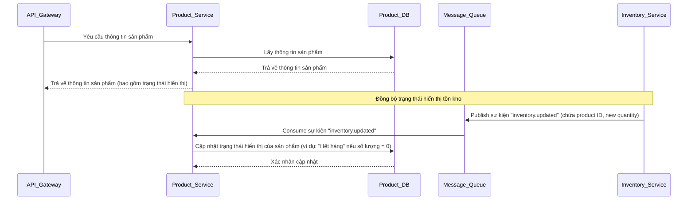

# Tài liệu Thiết kế Kỹ thuật: Dịch vụ Sản phẩm (Product Service)

## 1. Tổng quan

Dịch vụ Sản phẩm (Product Service) chịu trách nhiệm quản lý thông tin chi tiết về sản phẩm trong hệ thống thương mại điện tử. Nó cung cấp các API để truy xuất thông tin sản phẩm, bao gồm tên, mô tả, giá, hình ảnh và trạng thái. Đặc biệt, nó đồng bộ trạng thái hiển thị của sản phẩm (ví dụ: "Còn hàng" / "Hết hàng") với tồn kho thực tế thông qua Message Queue để đảm bảo thông tin hiển thị cho người dùng luôn chính xác.

## 2. Yêu cầu

### 2.1 Yêu cầu Chức năng

*   Là người dùng, tôi muốn có thể tìm kiếm và xem thông tin chi tiết về sản phẩm.
*   Là hệ thống, cần cập nhật trạng thái hiển thị của sản phẩm dựa trên sự kiện thay đổi tồn kho từ Inventory Service.
*   Là hệ thống, cần cung cấp thông tin sản phẩm cho Frontend và các dịch vụ khác.

### 2.2 Yêu cầu Phi chức năng

*   **Hiệu suất:** Tốc độ truy xuất thông tin sản phẩm phải nhanh, đặc biệt đối với các sản phẩm được xem nhiều.
*   **Độ tin cậy:** Đảm bảo thông tin sản phẩm luôn chính xác và nhất quán.
*   **Khả năng mở rộng:** Có thể xử lý lượng lớn yêu cầu đọc thông tin sản phẩm.
*   **Bảo mật:** Bảo vệ dữ liệu sản phẩm khỏi truy cập trái phép.

## 3. Thiết kế Kỹ thuật

### 3.1. Thay đổi Mô hình Dữ liệu

*   **Product DB:**
    *   `Product` (ID, Name, Description, Price, ImageURLs, DisplayStatus (e.g., "Còn hàng", "Hết hàng"), CategoryID, ...).
    *   `ProductAttribute` (ID, ProductID, AttributeName, AttributeValue, ...).
    *   `ProductCategory` (ID, Name, ...).

### 3.2. Thay đổi API

*   `GET /api/products`: Lấy danh sách sản phẩm (có thể kèm theo bộ lọc).
    *   Response: `[{ productId, name, price, displayStatus, ... }]`
*   `GET /api/products/{id}`: Lấy thông tin chi tiết một sản phẩm.
    *   Response: `{ productId, name, description, price, imageURLs, displayStatus, ... }`
*   `POST /api/products/{id}/update-display-status`: Endpoint nội bộ để cập nhật trạng thái hiển thị sản phẩm (chỉ được gọi bởi Product Service khi consume event).

### 3.3. Thay đổi UI
*   Hiển thị thông tin sản phẩm và trạng thái "Còn hàng" / "Hết hàng" trên trang chi tiết sản phẩm và danh sách sản phẩm.
*   Chức năng tìm kiếm và lọc sản phẩm.

### 3.4. Luồng Logic

### 3.5. Caching Strategy

*   Sử dụng cache (Redis/Memcached) cho thông tin sản phẩm chi tiết và danh sách sản phẩm phổ biến để giảm tải cho Product DB.
    *   Cache key: `product:{productId}`, `products:category:{categoryId}`, `products:search:{query}`.
    *   TTL: Phù hợp với tần suất thay đổi dữ liệu sản phẩm (ví dụ: 1 giờ hoặc được invalidation khi có cập nhật sản phẩm).

### 3.6. Concurrency Handling

*   Các thao tác đọc là chủ yếu và không yêu cầu xử lý concurrency phức tạp.
*   Các cập nhật trạng thái hiển thị từ sự kiện `inventory.updated` được xử lý bất đồng bộ, đảm bảo tính nhất quán cuối cùng.

### 3.7. Phụ thuộc

*   **Microservices:** Không phụ thuộc trực tiếp vào các service khác để thực hiện chức năng chính, nhưng là consumer của `Inventory Service` qua Message Queue.
*   **Message Queue:** Kafka (để consume `inventory.updated` events).
*   **Database:** Product DB (ví dụ: PostgreSQL, MySQL).

### 3.8. Cân nhắc Bảo mật

*   Đảm bảo các API chỉ đọc thông tin sản phẩm được công khai hoặc bảo vệ bằng API key nếu có thông tin nhạy cảm.
*   Các endpoint cập nhật (nếu có) phải được bảo vệ nghiêm ngặt bằng xác thực và ủy quyền.

### 3.9. Cân nhắc Hiệu suất

*   **Sử dụng Cache:** Giảm đáng kể số lượng truy vấn đến database.
*   **Đồng bộ bất đồng bộ:** Việc cập nhật trạng thái hiển thị thông qua Message Queue giúp Product Service không bị chặn bởi các thao tác của Inventory Service.
*   **Tối ưu hóa tìm kiếm:** Sử dụng các giải pháp tìm kiếm chuyên biệt (ví dụ: Elasticsearch) cho các yêu cầu tìm kiếm phức tạp nếu cần.

## 4. Kế hoạch Kiểm tra

*   **Unit Tests:** Viết unit tests cho các lớp xử lý logic nghiệp vụ và repository của Product Service.
*   **Integration Tests:**
    *   Kiểm tra việc consume sự kiện `inventory.updated` từ Message Queue và cập nhật chính xác trạng thái hiển thị sản phẩm.
    *   Kiểm tra các API truy xuất thông tin sản phẩm.
*   **Performance Tests:** Kiểm tra hiệu suất của các API tìm kiếm và truy xuất sản phẩm dưới tải cao.

## 5. Câu hỏi Mở

*   Có cần triển khai tìm kiếm toàn văn (full-text search) cho sản phẩm không, và nếu có thì sử dụng công nghệ nào (ví dụ: Elasticsearch)?
*   Chiến lược cập nhật thông tin sản phẩm (tên, mô tả, giá) từ hệ thống quản lý sản phẩm (PIM) sẽ như thế nào?

## 6. Các Phương án Đã Xem xét

*   **Product Service trực tiếp truy vấn Inventory Service:** Loại bỏ vì sẽ tạo ra coupling chặt chẽ và tăng tải cho Inventory Service, đặc biệt là trong các sự kiện sale. Tiếp cận event-driven là lựa chọn tốt hơn.
*   **Product Service lưu trữ tồn kho thực tế:** Loại bỏ vì sẽ tạo ra một nguồn sự thật thứ hai về tồn kho, dẫn đến nguy cơ dữ liệu không nhất quán và phức tạp hóa việc quản lý tồn kho. Inventory Service là nguồn sự thật duy nhất.